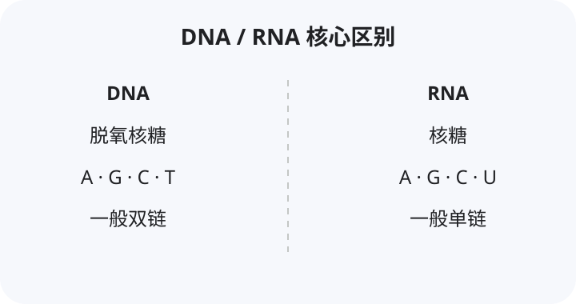

# 生物 · 必修1 分子与细胞（人教版）

## 第一章 走近细胞
### 1.1 细胞是生命活动的基本单位
- **必考点**：生命活动离不开细胞；生命系统结构层次
  - 细胞→组织→器官→系统（植物无系统）→个体→种群→群落→生态系统→生物圈
  - **细胞是最基本的生命系统**；种群与群落、生态系统的区分（高频）
- 细胞学说（施莱登、施旺）：揭示动物植物统一性；新细胞由老细胞分裂产生
### 1.2 细胞的多样性和统一性
- **必考点**：原核细胞与真核细胞
  - 原核生物：细菌、蓝细菌（蓝藻，含叶绿素和藻蓝素，能光合，无叶绿体）、支原体
  - 真核生物：动物、植物、真菌（酵母菌、霉菌）
  - 根本区别：有无以核膜为界限的细胞核
- **易错点**：蓝细菌无叶绿体但能光合作用；细菌名称判断（"杆、球、螺旋、弧"菌多为细菌）；乳酸菌是细菌
- 高倍显微镜使用（先低后高、调光圈、细准焦螺旋）

## 第二章 组成细胞的分子
### 2.1 细胞中的元素和化合物
- **必考点**：最基本元素C；大量元素（C、H、O、N、P、S、K、Ca、Mg）；微量元素（Fe、Mn、Zn、Cu、B、Mo）
- 鲜重含量最多O、干重最多C；化合物中水最多、蛋白质是含量最多的有机物
- 有机物检测：还原糖（斐林试剂，水浴加热，砖红色）、脂肪（苏丹Ⅲ橘黄）、蛋白质（双缩脲，紫色）、淀粉（碘液蓝色）
- **易错点**：斐林试剂现配现用、甲乙等量混合；双缩脲先加A液再加B液
### 2.2 细胞中的无机物
- 水：自由水（良好溶剂、参与反应、运输）与结合水（细胞结构成分）；比值与代谢/抗逆性
- 无机盐：主要以离子形式存在；作用（如 Fe→血红蛋白、Mg→叶绿素、I→甲状腺激素、Ca、P）
### 2.3 糖类和脂质
- **必考点**：糖类是主要能源物质
  - 单糖（葡萄糖、果糖、核糖、脱氧核糖）；二糖（蔗糖、麦芽糖、乳糖）；多糖（淀粉、糖原、纤维素、几丁质）
- 脂质：脂肪（储能、保温、缓冲）、磷脂（生物膜基本支架）、固醇（胆固醇、性激素、维生素D）
- **易错点**：纤维素是结构物质不供能；植物特有蔗糖/麦芽糖/淀粉/纤维素，动物特有乳糖/糖原
### 2.4 蛋白质是生命活动的主要承担者
- **必考点·重难点**：氨基酸（基本单位，约21种）结构通式，结构特点（至少一个氨基一个羧基连在同一碳原子）
- 脱水缩合：肽键 $-\text{CO}-\text{NH}-$
  - 肽键数 = 脱去水分子数 = 氨基酸数 − 肽链数
  - 蛋白质相对分子质量 = 氨基酸总质量 − 水的质量
- 结构多样性原因（氨基酸种类、数目、排列顺序、肽链空间结构）；功能（催化、运输、免疫、调节、结构）
- **易错点**：变性破坏空间结构不断肽键；盐析可逆
### 2.5 核酸是遗传信息的携带者
- **必考点**：DNA（脱氧核糖核酸，主要在细胞核）与 RNA（核糖核酸，主要在细胞质）
- 基本单位核苷酸（磷酸+五碳糖+含氮碱基）；DNA碱基A/T/C/G，RNA为A/U/C/G
- 核酸是细胞内携带遗传信息的物质；DNA多样性
- 

## 第三章 细胞的基本结构
### 3.1 细胞膜的结构和功能
- **必考点**：功能（将细胞与外界分隔、控制物质进出、进行细胞间信息交流）
- 流动镶嵌模型：磷脂双分子层（基本支架）、蛋白质（镶嵌/贯穿）、糖被（糖蛋白，识别）
- **结构特点**：具有一定流动性；**功能特点**：选择透过性
### 3.2 细胞器之间的分工合作
- **必考点·重难点**：
  - 双层膜：线粒体（有氧呼吸主要场所，"动力车间"）、叶绿体（光合作用场所）
  - 单层膜：内质网、高尔基体、液泡、溶酶体
  - 无膜：核糖体（蛋白质合成）、中心体（动物和低等植物，与分裂有关）
- 分泌蛋白合成运输：核糖体→内质网（囊泡）→高尔基体（囊泡）→细胞膜（线粒体供能）；生物膜系统
- **易错点**：植物特有细胞壁、叶绿体、液泡；动物和低等植物有中心体
### 3.3 细胞核的结构和功能
- **必考点**：核膜（双层、有核孔）、核仁（与核糖体RNA合成有关）、染色质（DNA+蛋白质）
- 核孔是大分子（mRNA、蛋白质）通道；细胞核是遗传信息库、代谢和遗传控制中心
- 染色质与染色体是同一物质不同时期两种形态

## 第四章 细胞的物质输入和输出
### 4.1 被动运输
- **必考点·重难点**：渗透作用条件（半透膜、浓度差）；动物/植物细胞吸水失水
- 质壁分离与复原（成熟植物细胞，原生质层、细胞液）；可判断细胞死活、测浓度
- 自由扩散（高→低，不需载体能量，如 O₂、CO₂、水、甘油）；协助扩散（需载体/通道，如葡萄糖进红细胞）
### 4.2 主动运输与胞吞胞吐
- **必考点·重难点**：主动运输（低→高，需载体和能量，如小肠吸收葡萄糖、氨基酸、离子）
- 胞吞胞吐（大分子，依赖膜流动性、耗能，如分泌蛋白、吞噬细胞）
- **易错点**：运输方向、是否耗能、载体专一性；影响因素（O₂、温度、呼吸抑制剂）

## 第五章 细胞的能量供应和利用
### 5.1 降低化学反应活化能的酶
- **必考点**：酶的本质（活细胞产生的有机物，绝大多数蛋白质、少数RNA）；作用机理（降低活化能）
- 特性：高效性、专一性、作用条件温和；影响因素（温度、pH，过高过低/过酸过碱）
- 实验：比较过氧化氢在不同条件下分解（对照、单一变量）
### 5.2 细胞的能量"货币"ATP
- **必考点**：ATP结构简式 $\text{A}-\text{P}\sim\text{P}\sim\text{P}$；ATP与ADP相互转化（能量供应机制）
- 光合作用、呼吸作用产生ATP；ATP是直接能源物质
### 5.3 细胞呼吸的原理和应用
- **必考点·重难点**：
  - 有氧呼吸三阶段（总反应：$\text{C}_6\text{H}_{12}\text{O}_6+6\text{O}_2+6\text{H}_2\text{O}\to6\text{CO}_2+12\text{H}_2\text{O}+能量$）
    - 第一阶段细胞质基质、第二阶段线粒体基质、第三阶段线粒体内膜
  - 无氧呼吸（细胞质基质）：产酒精+CO₂（酵母菌、植物）或乳酸（乳酸菌、动物、马铃薯块茎）
- 影响因素（O₂浓度、温度、含水量）；应用（松土、酿酒、保鲜）
- **易错点**：CO₂产生与O₂消耗判断呼吸方式；有氧呼吸产物H₂O中O来自O₂
### 5.4 光合作用与能量转化
- **必考点·重难点**：
  - 色素提取分离（无水乙醇提取、层析液分离；叶绿素a/b、胡萝卜素、叶黄素；吸收红光蓝紫光）
  - 光反应（类囊体薄膜，水的光解产O₂、ATP、NADPH）
  - 暗反应/碳反应（叶绿体基质，CO₂固定、C₃还原）
  - 总反应：$6\text{CO}_2+12\text{H}_2\text{O}\xrightarrow{光能、叶绿体}\text{C}_6\text{H}_{12}\text{O}_6+6\text{O}_2+6\text{H}_2\text{O}$
- 影响因素（光照强度、CO₂浓度、温度）；光补偿点、光饱和点；总/净光合关系
- **易错点**：净光合=总光合−呼吸；突然改变光照/CO₂对C₃、C₅、ATP含量影响

## 第六章 细胞的生命历程
### 6.1 细胞的增殖
- **必考点·重难点**：细胞周期（分裂间期+分裂期）；有丝分裂各时期特点
  - 间期复制、前期（膜仁消失现两体）、中期（着丝粒排列赤道板，最清晰）、后期（着丝粒分裂、染色体加倍）、末期（两消两现）
- 动植物有丝分裂区别（前期纺锤体来源、末期细胞质分裂方式）；意义（遗传性状稳定）
- 无丝分裂（蛙的红细胞）
### 6.2 细胞的分化
- **必考点**：分化概念（持久性、稳定性、不可逆）；实质是基因选择性表达
- 细胞全能性（已分化细胞仍具发育成完整个体潜能，植物>动物）；干细胞
### 6.3 细胞的衰老和死亡
- 衰老特征（水分减少、酶活性降低、色素积累、呼吸减慢、膜通透性改变）
- 细胞凋亡（基因决定的程序性死亡，对机体有利）vs 细胞坏死（不利、被动）
- **易错点**：凋亡≠坏死；衰老细胞中多种酶活性降低但部分与衰老有关酶活性升高

## 必做实验汇总
- 检测还原糖/脂肪/蛋白质；观察DNA和RNA分布
- 用高倍镜观察叶绿体和线粒体、质壁分离与复原
- 探究酵母菌呼吸方式、色素提取分离、观察根尖有丝分裂
- 探究酶活性条件、光合作用影响因素

## 相关学科
- [化学 · 物质结构与反应](subject:chemistry)
- [地理 · 植被与土壤](subject:geography)
