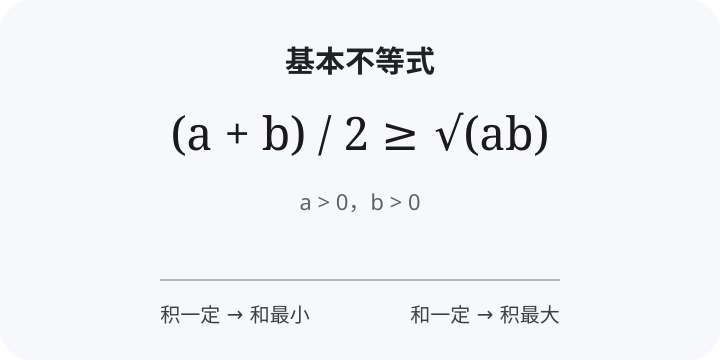

# 高中数学

## 集合与常用逻辑用语
- 集合的表示
- 子集与真子集
- 交集、并集、补集

## 基本不等式
- 核心公式
  - **基本不等式：** $\frac{a+b}{2} \geq \sqrt{ab}$（$a>0, b>0$）
  - **常用形式：** $a+b \geq 2\sqrt{ab}$
  - **等号成立：** $a=b$
- 一正、二定、三相等
- 积一定 → 和最小
- 和一定 → 积最大
- 常见模型
  - $x+\frac{a}{x}$
  - $ax+\frac{b}{x}$
  - 配凑定和 / 定积
- 图示示例
  - 

## 函数
- 定义与表示
- 单调性
- 奇偶性
- 最值
- 二次函数
- 指数函数与对数函数

## 相关学科
- [物理 · 模型与计算](subject:physics)
- [化学 · 定量分析](subject:chemistry)
